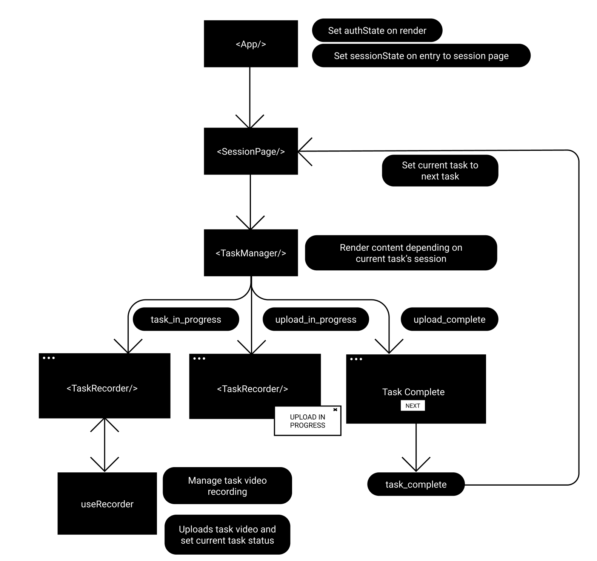

# PARK

## Stack Overview

- UI: [material-ui](https://material-ui.com/), [recharts](https://recharts.org/en-US/)
- Forms: [formik](https://formik.org/), [material-ui-formik](https://stackworx.github.io/formik-material-ui/), [yup](https://github.com/jquense/yup)
- State management: [recoil](https://github.com/facebookexperimental/Recoil)
- Icons and Animations: [react-lottie](https://github.com/chenqingspring/react-lottie), [framer-motion](https://www.framer.com/api/motion/)
- Recording: [recordrtc](https://github.com/muaz-khan/RecordRTC), [react-player](https://github.com/cookpete/react-player)
- Backend: [firebase](https://firebase.google.com/), [axios](https://github.com/axios/axios)
- Routing: [react-router-dom](https://reactrouter.com/web/guides/quick-start)

## Development

1. Start up react server: `yarn start`
2. Start up firebase emulators: `firebase emulators:start`

## Deployment

1. Login to Firebase CLI: `firebase login`
2. Perform build: `yarn build`
3. Deploy to Firebase Hosting: `firebase deploy`

## Project structure

```
📦src
 ┣ 📂assets - lottie/image assets
 ┣ 📂components
 ┃ ┣ 📜Feedback.tsx - Feedback dashboard
 ┃ ┣ 📜PageLoader.tsx - Full screen loader
 ┃ ┣ 📜Panel.tsx - Full height Grid
 ┃ ┣ 📜TaskManager.tsx - Controls task UI/UX
 ┃ ┣ 📜TaskRecorder.tsx - Standard task recorder with instruction
 ┃ ┗ 📜EyeGazeTracker.tsx - Eye gaze tracking task recorder
 ┣ 📂pages
 ┃ ┣ 📜AuthPage.tsx - Register, Login, Rest password pages
 ┃ ┣ 📜HomePage.tsx - Home page
 ┃ ┗ 📜SessionPage.tsx - Session page
 ┣ 📂services
 ┃ ┣ 📜distribution.ts - Confidence distribution for each task
 ┃ ┣ 📜ml.ts - ML API interaction
 ┃ ┣ 📜recorder.ts - useRecorder
 ┃ ┣ 📜state.ts - recoil state management
 ┃ ┣ 📜tasks.ts - task configuration (instruction, tutorial url..)
 ┃ ┗ 📜types.ts - project type definitions
 ┣ 📜App.tsx - Manage navigation and set global states
 ┣ 📜index.tsx
```

## Overview

### State management

Using recoil, three global states are defined: `sessionState`, `authState`, and `alertState`.

1. `sessionState` tracks user's progress and task states throughout session page.

2. `authState` tracks authentication state of current user

3. `alertState` tracks content to display through [snackbar](https://material.io/components/snackbars#usage).

#### Session state management diagram



#### Usage

```tsx
import React from "react";
import { useRecoilState } from "recoil";
import { authState, sessionState, alertState } from "./services/state";

const authComponent = () => {
  const [auth, setAuth] = useRecoilState(authState);
  return `id: ${auth.userID}, email: ${auth.email}`;
};

const sessionComponent = () => {
  const [session, setSession] = useRecoilState(sessionState);
  return `session: ${session.currentTask}`;
};

const alertComponent = () => {
  const [alert, setAlert] = useRecoilState(alertState);
  const sendMessage = () => setAlert({ type: "info", content: "hell0 world" });

  return <Button onClick={sendMessage}>Send Message</Button>;
};
```

### useRecorder

`record.ts` defines a useRecorder hook which manages recording/uploading of task videos.

#### Methods

1. `start`: Request access to webcam/mic and start recording
2. `retry`: Stop recording and set recorder to initial state
3. `stop`: Stop recording and return task video
4. `end`: Takes in a task file and uploads it to backend. Also updates currentTask's status to `upload_in_progress` and `upload_complete` throughout the process.

#### Usage

```tsx
const recordComponent = () => {
  const recorder = useRecorder();
  const finish = async () => {
    // stop and return task video
    const file = await recorder.stop();
    // upload file to backend
    await recorder.end(file);
  };

  return (
    <Box>
      <ReactPlayer url={recorder.stream} />
      <Button onClick={recorder.start}>Start Recording</Button>
      <Button onClick={recorder.reset}>Reset Recording</Button>
      <Button onClick={finish}>Finish Recording</Button>
    </Box>
  );
};
```

## Important Notes

1. `recordrtc` has an issue in macOS where 1.5 ~ 2 second of delay has to be added between `navigator.getUserMedia()` and `startRecording()`. [Otherwise, audio and video will be out of sync](https://github.com/muaz-khan/RecordRTC/issues/738).

2. `ml.ts` uses test files under google cloud storage in development since files inside emulator are saved to local disk.

3. The task files should be of format `<date>_<uid>_<task name>.webm`.

4. Ensure that there's a way to query the task file locations later. `record.ts` writes a document in firestore storing: session date, user's uid, task name, and google storage location.

## Useful tools to consider

1. [react devtools](https://reactjs.org/blog/2019/08/15/new-react-devtools.html)
2. [StoryBook](https://storybook.js.org/)
3. [Cypress](https://www.cypress.io/)

## Web development resources

1. [Firebase documentation](https://firebase.google.com/docs)
2. [Fireship](https://fireship.io/)
3. [React documentation](https://reactjs.org/docs/getting-started.html)
4. Design resources: [Uplabs](https://www.uplabs.com/)/[Dribble](https://dribbble.com/)
5. [LottieFiles](https://lottiefiles.com/)
